## Batch size policies vs Learning rate policies
### Step

```
scheduler_bs = StepBS(dataloader, step_size=4, gamma=2)
scheduler_lr = StepLR(optimizer, step_size=4, gamma=1.0 / 2)
```

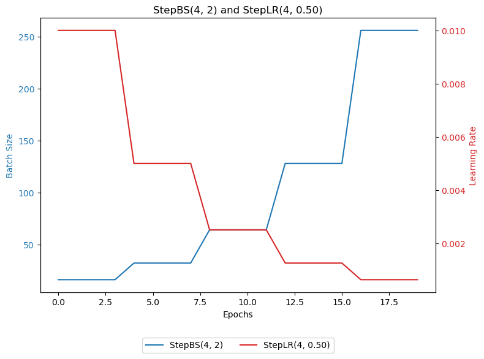

```
scheduler_bs = StepBS(dataloader, step_size=20, gamma=3)
scheduler_lr = StepLR(optimizer, step_size=20, gamma=1.0 / 3)
```

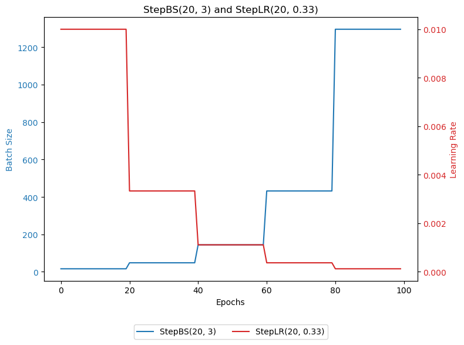
### MultiStep

```
scheduler_bs = MultiStepBS(dataloader, milestones=[5, 10, 12, 13], gamma=2)
scheduler_lr = MultiStepLR(optimizer, milestones=[5, 10, 12, 13], gamma=1.0 / 2)
```

![MultiStepBS([5, 10, 12, 13], 2) vs MultiStepLR([5, 10, 12, 13], 0.50)](./plots/MultiStep_1.png)

```
scheduler_bs = MultiStepBS(dataloader, milestones=[15, 40, 40, 50, 80], gamma=1.5)
scheduler_lr = MultiStepLR(optimizer, milestones=[15, 40, 40, 50, 80], gamma=1.0 / 1.5)
```

![MultiStepBS([15, 40, 40, 50, 80], 1.5) vs MultiStepLR([15, 40, 40, 50, 80], 0.67)](./plots/MultiStep_2.png)
### Constant

```
scheduler_bs = ConstantBS(dataloader, factor=5.0, milestone=5)
scheduler_lr = ConstantLR(optimizer, factor=1.0 / 5.0, total_iters=5)
```

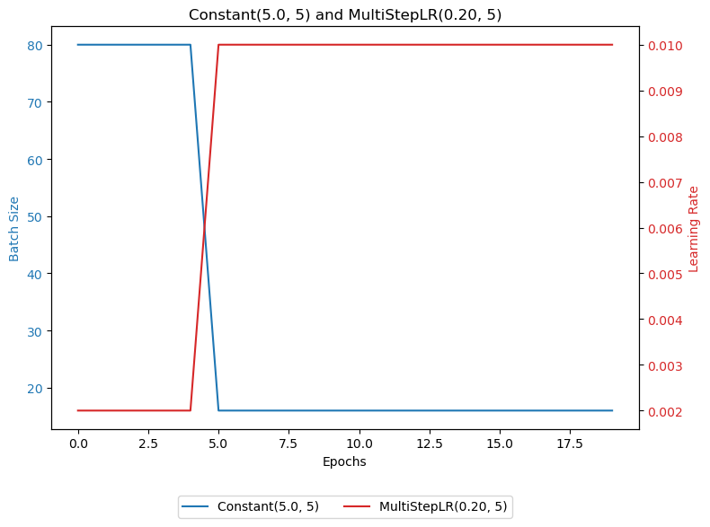
### Linear

```
scheduler_bs = LinearBS(dataloader, start_factor=1.0, end_factor=10.0, milestone=20)
scheduler_lr = LinearLR(optimizer, start_factor=1.0, end_factor=1.0 / 10.0, total_iters=20)
```

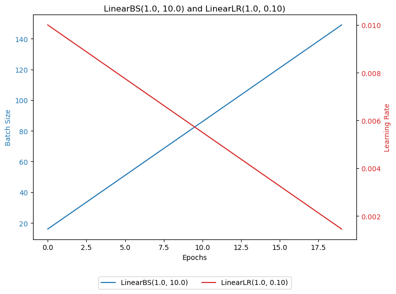
### Exponential

```
scheduler_bs = ExponentialBS(dataloader, gamma=1.05)
scheduler_lr = ExponentialLR(optimizer, gamma=1.0 / 1.05)
```

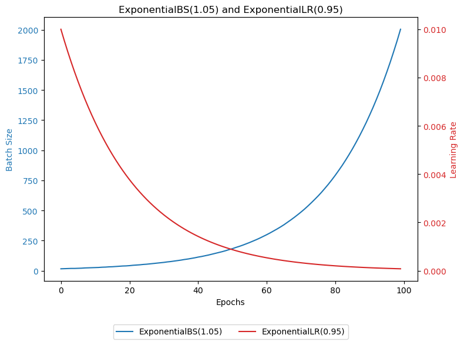
### Polynomial

```
scheduler_bs = PolynomialBS(dataloader, total_iters=50, power=1.5)
scheduler_lr = PolynomialLR(optimizer, total_iters=50, power=1.5)
```

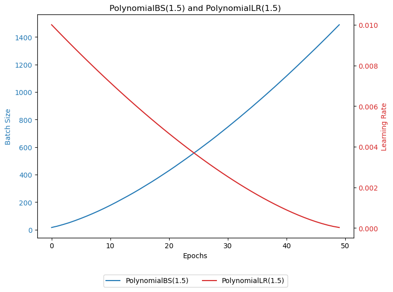

```
scheduler_bs = PolynomialBS(dataloader, total_iters=50, power=2)
scheduler_lr = PolynomialLR(optimizer, total_iters=50, power=2)
```

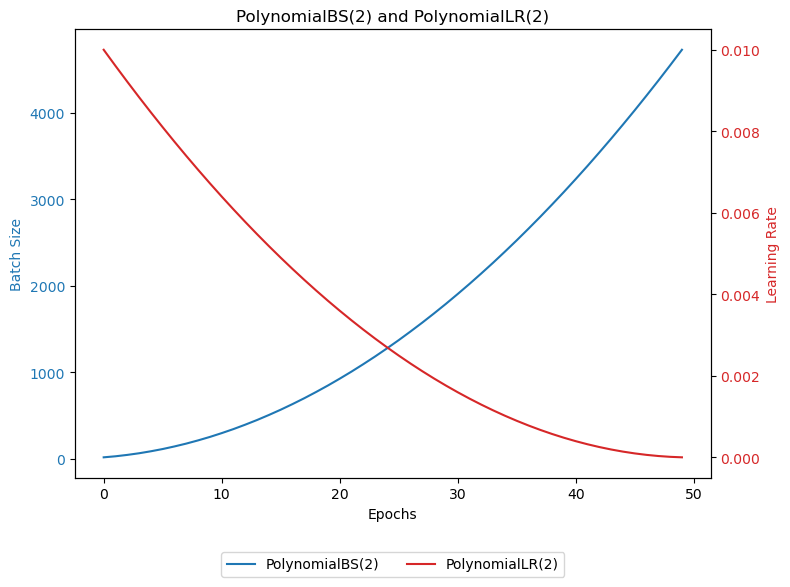
### CosineAnnealing

```
scheduler_bs = CosineAnnealingBS(dataloader, total_iters=10)
scheduler_lr = CosineAnnealingLR(optimizer, T_max=10)
```

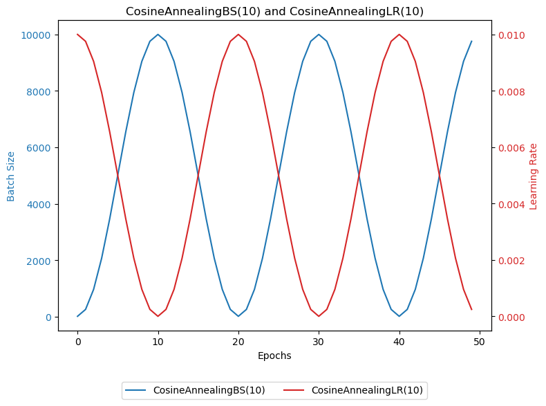
### Plateau

```
scheduler_bs = IncreaseBSOnPlateau(dataloader, factor=2.0)
scheduler_lr = ReduceLROnPlateau(optimizer, factor=1.0 / 2.0)
```

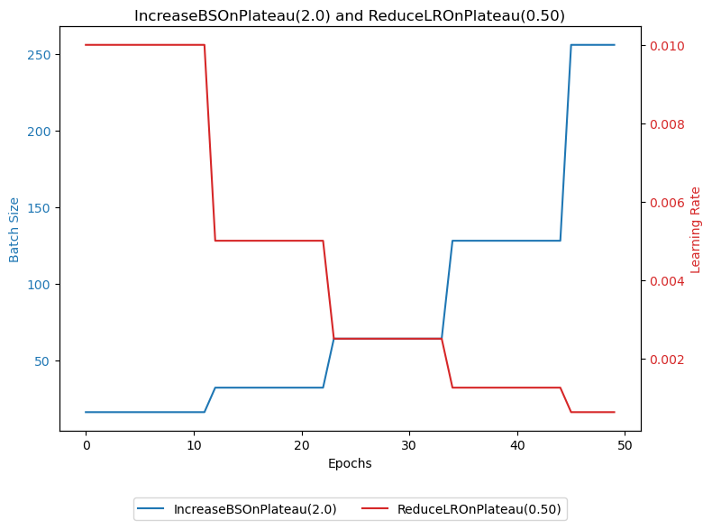
### Cyclic

```
scheduler_bs = CyclicBS(dataloader, base_batch_size=64, min_batch_size=16, mode=triangular, step_size_down=25)
scheduler_lr = CyclicLR(optimizer, base_lr=0.001, max_lr=0.01, mode=triangular, step_size_up=25)
```

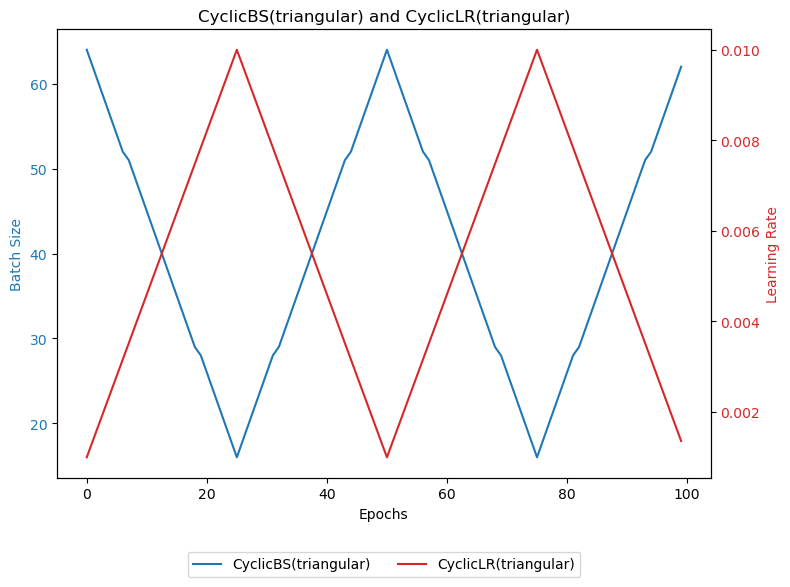

```
scheduler_bs = CyclicBS(dataloader, base_batch_size=64, min_batch_size=16, mode=triangular2, step_size_down=25)
scheduler_lr = CyclicLR(optimizer, base_lr=0.001, max_lr=0.01, mode=triangular2, step_size_up=25)
```

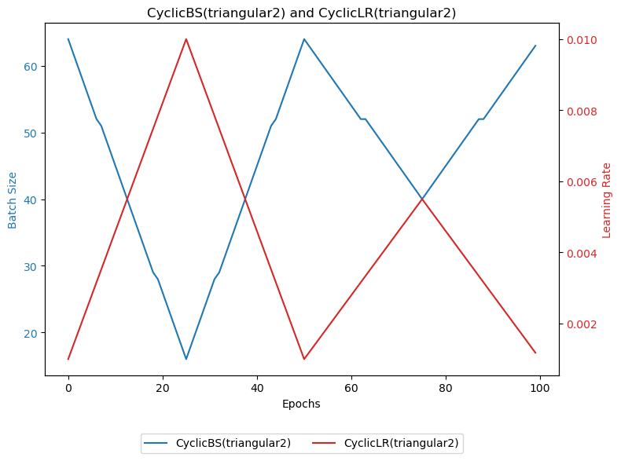

```
scheduler_bs = CyclicBS(dataloader, base_batch_size=64, min_batch_size=16, mode=exp_range, step_size_down=25, gamma=0.8)
scheduler_lr = CyclicLR(optimizer, base_lr=0.001, max_lr=0.01, mode=exp_range, step_size_up=25, gamma=0.8)
```

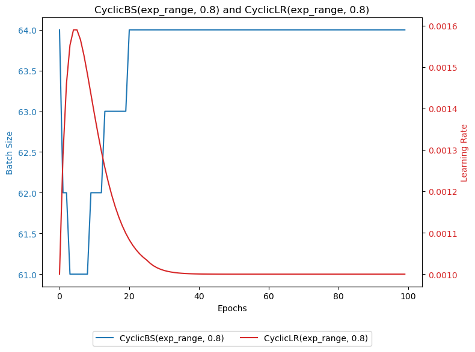
### CosineAnnealingWarmRestarts

```
scheduler_bs = CosineAnnealingBSWithWarmRestarts(dataloader, t_0=40, factor=1)
scheduler_lr = CosineAnnealingWarmRestarts(optimizer, T_0=40, T_mult=1)
```

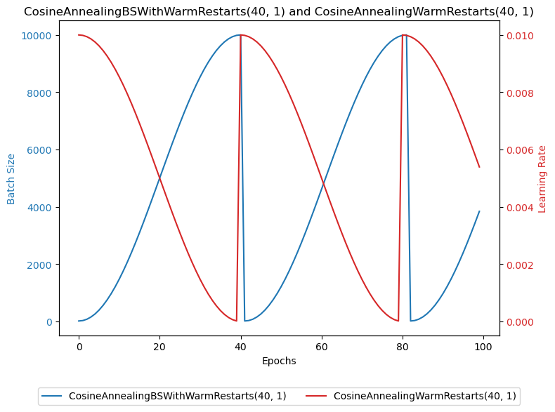

```
scheduler_bs = CosineAnnealingBSWithWarmRestarts(dataloader, t_0=30, factor=2)
scheduler_lr = CosineAnnealingWarmRestarts(optimizer, T_0=30, T_mult=2)
```

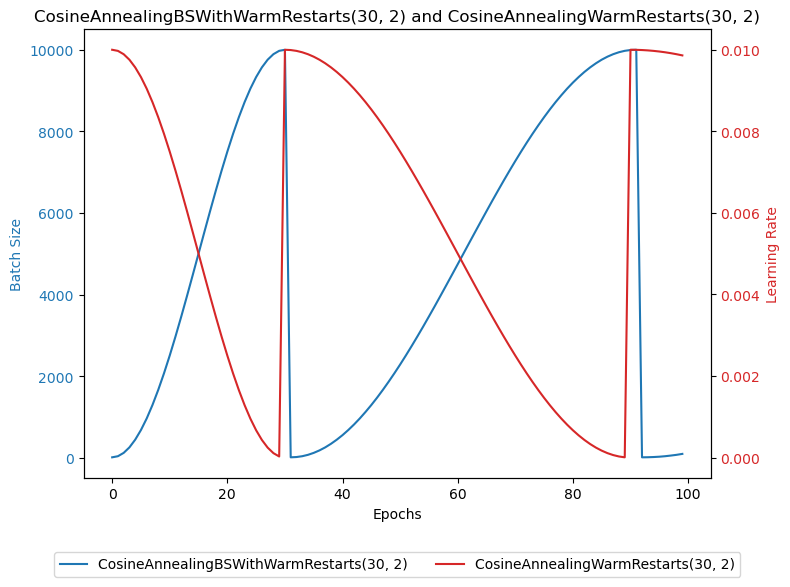
### OneCycle

```
scheduler_bs = OneCycleBS(dataloader, total_steps=100, decay_percentage=0.3, strategy=cos, max_batch_size=64, min_batch_size=16)
scheduler_lr = OneCycleLR(optimizer, total_steps=100, pct_start=0.3, anneal_strategy=cos, max_lr=0.1, div_factor=2, final_div_factor=2)
```

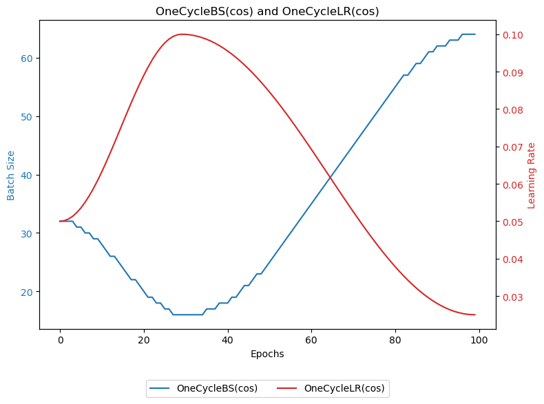

```
scheduler_bs = OneCycleBS(dataloader, total_steps=100, decay_percentage=0.3, strategy=linear, max_batch_size=64, min_batch_size=16)
scheduler_lr = OneCycleLR(optimizer, total_steps=100, pct_start=0.3, anneal_strategy=linear, max_lr=0.1, div_factor=10, final_div_factor=100)
```

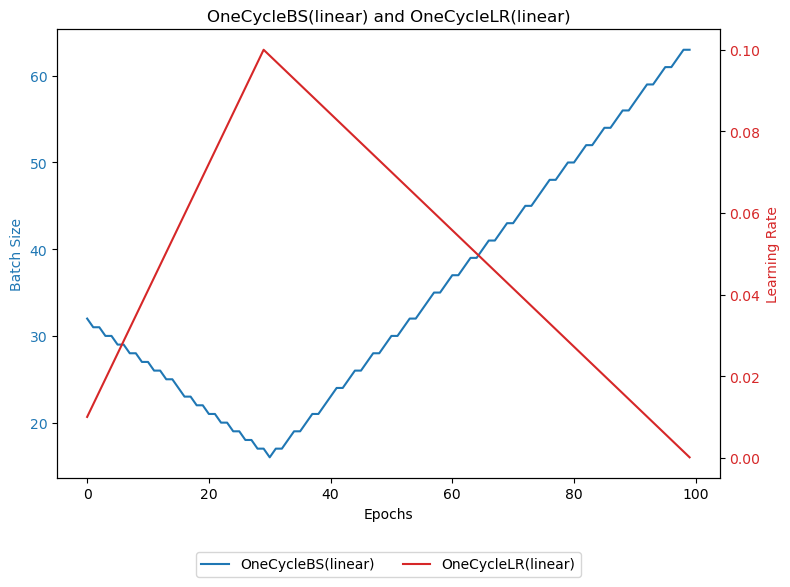
